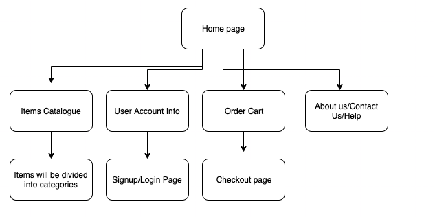

# _Capstone Project_

#### _Individual final capstone project for Epicodus._

#### By _**Kenny Halim**_

## Description

_An online marketplace that will allow user to browse through the available products in the store. The product will be separated into several categories. User will also be able to add items to their cart, see the total of their items, and order the item. User will then finally be able to login as well. On the developer side, they will be able to see each customers order in the admin page._

## Planning

__

## Setup/Installation Requirements

- Download and install Node.js
- Clone this repository: \$ git clone repo name
- Change into the work directory: \$ cd repo name
- Run the command \$ npm install
- Run the command \$ npm run start

## Support and contact details

_If you run into any issues or have questions, ideas or concerns. Please contact us at kennyhalim98@gmail.com_

## Technologies Used

- HTML
- CSS
- Javascript
- React
- Redux
- WebPack
- Node Package Manager

### License

_MIT_

Copyright (c) 2019 **_Kenny Halim_**
